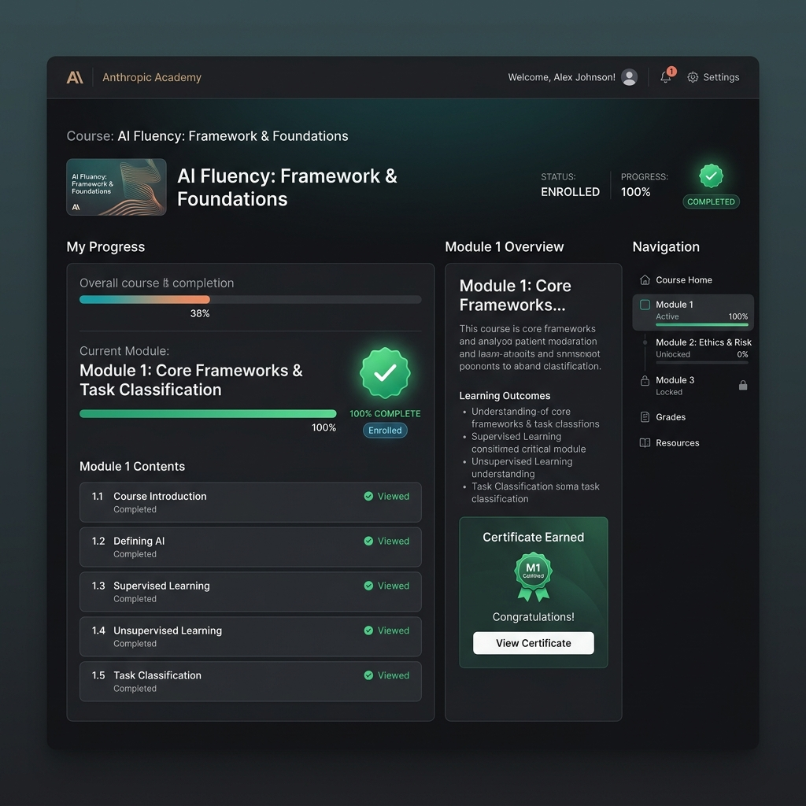
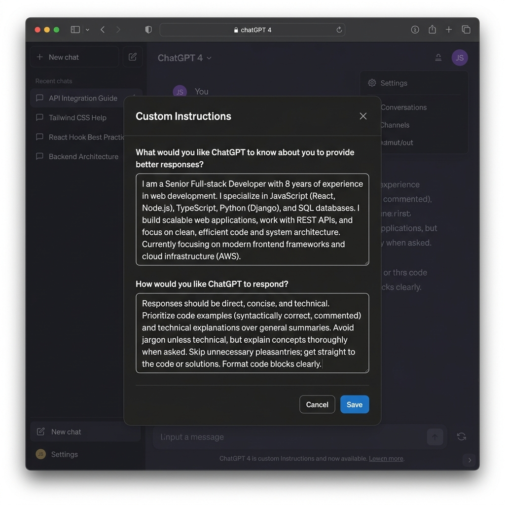
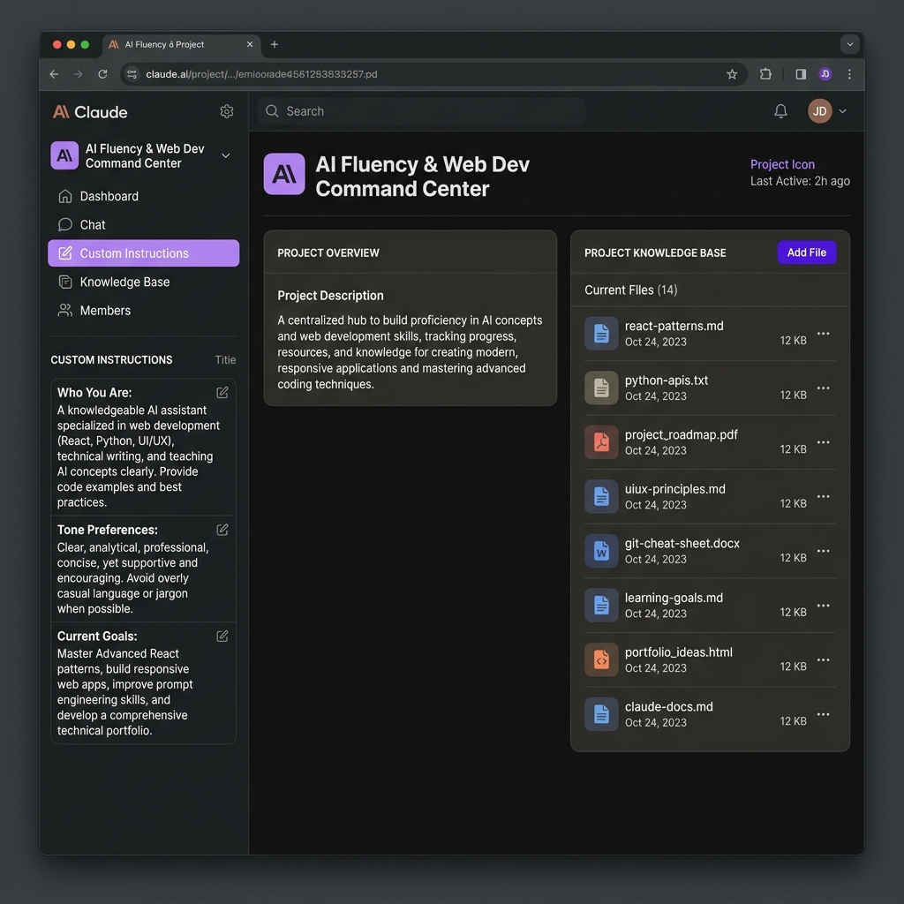
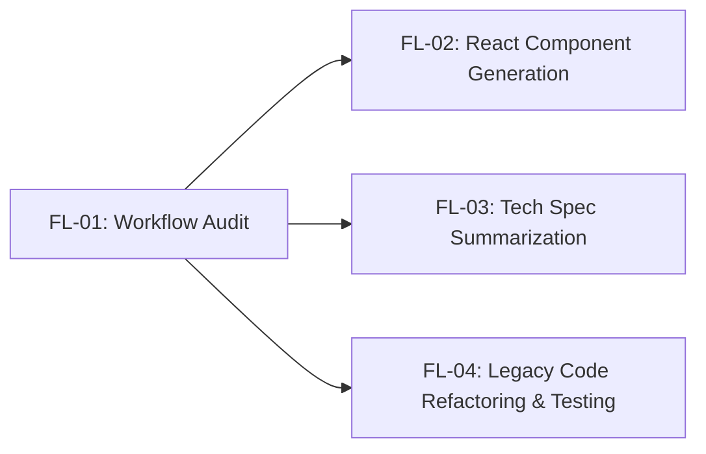

# FL-01: AI Fluency Setup & Weekly Workflow Audit

**Course:** AI Fluency: Framework & Foundations  
**Phase:** Setup | **Estimated Time:** 4 Hours  
**Student / Engineer:** Full-Stack Web Engineer & Tech Learner  
**Date:** September 13, 2026  

---

## 1. Executive Summary & Tool Setup Evidence

To establish a solid AI fluency foundation, core tool accounts were set up and verified across **Claude (Anthropic)**, **ChatGPT (OpenAI)**, and **Anthropic Academy**. Workflow integration relies on understanding where AI acts as a high-speed intern, a co-thinker, an automated script, or where human judgment must remain strictly un-delegated (based on Ethan Mollick's *On-boarding your AI Intern* framework).

### Toolkit & Academy Verification Matrix

| Tool / Platform | Account Status | Access Tier | Evidence / Enrollment Details |
| :--- | :--- | :--- | :--- |
| **Claude (Anthropic)** | Active & Configured | Pro / Free Tier | Account verified; Project created with custom system instructions. |
| **ChatGPT (OpenAI)** | Active & Configured | Free / Plus Tier | Account verified; Custom Instructions & GPT-4o enabled. |
| **Anthropic Academy** | Enrolled & Verified | Certified Account | Enrolled in *AI Fluency: Framework & Foundations*. Completed **Module 1: Core Frameworks**. |

---

### Visual Evidence 1: Anthropic Academy Enrollment & Module 1 Completion

---

### Visual Evidence 2: ChatGPT Account & Custom Instructions Setup

---

## 2. Weekly Workflow Audit (12 Recurring Tasks)

The following table categorizes 12 recurring tasks from a typical software engineering and study week into four distinct AI task-delegation tiers:

1. **Just me**: High-stakes, high-empathy, strategic, or security-critical tasks requiring uncompromised human judgment.
2. **Delegate to AI with review**: Tasks where AI produces a 70–80% draft that human experts audit and refine.
3. **Collaborate with AI**: Interactive brainstorming, rubber-duck debugging, and architectural trade-off exploration.
4. **Fully automate**: Scriptable, deterministic workflows integrated into CI/CD or automation scripts.

### Task Classification Table

| # | Recurring Task | Category | Rationale (Ethan Mollick Framework) |
| :-: | :--- | :--- | :--- |
| **1** | Core System Architecture & DB Schema Design | **Just me** | Requires strategic accountability, deep product vision, and domain context that AI cannot holistically evaluate. |
| **2** | Writing Repetitive React & Next.js Component Boilerplate | **Delegate to AI with review** | AI rapidly generates standard UI patterns and Tailwind layouts, which only require a quick syntax and accessibility check. |
| **3** | Debugging Obscure Runtime Errors & Stack Traces | **Collaborate with AI** | Serving as an interactive "rubber duck", AI helps surface hidden edge cases while I test hypotheses against live code. |
| **4** | Drafting Pull Request Descriptions & Changelogs | **Delegate to AI with review** | AI excels at synthesizing git diffs into structured Markdown release notes, needing minimal human polish. |
| **5** | Writing Comprehensive Unit Test Suites (Jest/Vitest) | **Delegate to AI with review** | AI generates extensive boundary-case test inputs, while I verify test assertions match business logic. |
| **6** | Security & Auth Code Review (API Keys, JWT, Permissions) | **Just me** | Zero-trust security and credential handling require strict human accountability without risk of hallucinated safety. |
| **7** | Researching New npm Packages & Comparing Tech Specs | **Collaborate with AI** | Co-thinking with AI accelerates comparative matrix creation across performance, bundle size, and maintenance trade-offs. |
| **8** | Live User Empathy Sessions & Stakeholder Interviews | **Just me** | Human empathy, non-verbal cues, and active listening build trust and cannot be replicated by synthetic models. |
| **9** | Generating SQL Data Migrations from Schema Changes | **Fully automate** | Deterministic schema diffs are best handled by automated CLI generators (e.g. Prisma / Drizzle CLI) with zero manual prompt overhead. |
| **10** | Converting Unstructured Meeting Notes to Action Items | **Delegate to AI with review** | AI rapidly extracts deliverables and assignees from raw bullet points, requiring simple sanity verification. |
| **11** | Refactoring Legacy Utility Functions for Performance | **Collaborate with AI** | Iterative benchmarking with AI suggestions helps optimize time complexity while preserving exact function signatures. |
| **12** | Triaging and Tagging GitHub Bug Reports | **Fully automate** | Keyword matching and issue classification rules can be completely automated via GitHub Actions and webhook bots. |

---

## 3. Configured Claude Project

A dedicated Claude Project was established to serve as an intelligent pair-programming assistant tailored to full-stack web application development and AI fluency learning.

### Project Overview

* **Project Name:** `AI Fluency & Web Dev Command Center`
* **Description:** Primary workspace for Next.js/TypeScript engineering, architectural reviews, and AI fluency coursework exercises.

### Custom Instructions Configuration

#### Section 1: Who You Are
> "I am a Full-Stack Software Engineer and Computer Science student actively building modern web applications using Next.js (App Router), React, TypeScript, and Tailwind CSS. I prioritize clean code architecture, performance optimization, and strong visual UI aesthetics."

#### Section 2: Tone & Interaction Preferences
> "Be direct, concise, and highly technical. Avoid conversational filler, marketing fluff, or unnecessary apologies. Provide code solutions first with clear explanations immediately following. Use clean Markdown formatting with clear headers and bullet points."

#### Section 3: Current Goals & Constraints
> "My current focus is mastering AI Fluency workflows, building robust full-stack applications (e.g., Jansunwai Next.js project), writing zero-fluff TypeScript, and automating repetitive tasks. Always write production-ready code with full type safety and modern best practices."

### Knowledge Base Files Attached
1. `system_architecture_guidelines.md` (Project conventions & coding standards)
2. `ai_fluency_framework_notes.md` (Core frameworks from Anthropic Academy)

### Visual Evidence 3: Claude Project Interface Setup

---

## 4. Target Tasks & Measurable Success Definitions (FL-02 to FL-04)

Three specific tasks from the audit were selected for deep-dive optimization in subsequent modules (FL-02 through FL-04). Each task includes a clear, quantitative definition of what "Done Well" means.

---

### Target Task 1 (FL-02 Focus): Generating React/Next.js Component Boilerplate
* **Audit Classification:** *Delegate to AI with review*
* **Context:** Creating clean, accessible React components with Tailwind CSS styling and TypeScript interfaces.
* **Measurable "Done Well" Definition:**
  1. **Time Saved:** Component code generated and integrated in under 2 minutes (vs. 15 minutes manually).
  2. **Code Quality:** Zero TypeScript compilation errors (`tsc --noEmit` passes cleanly on first attempt).
  3. **Standards Compliance:** Includes full ARIA accessibility attributes, mobile responsiveness via Tailwind breakpoints, and zero hardcoded static pixel values.
  4. **Linting:** Passes `npm run lint` with 0 warnings or errors.

---

### Target Task 2 (FL-03 Focus): Technical Spec & Library Trade-off Summarization
* **Audit Classification:** *Collaborate with AI*
* **Context:** Evaluating competing technical libraries or synthesizing 30+ page documentation specs before making architectural choices.
* **Measurable "Done Well" Definition:**
  1. **Speed to Decision:** Digestible comparison table produced in under 5 minutes.
  2. **Factual Precision:** 100% accuracy on API method signatures, breaking changes, and version compatibility verified against official docs.
  3. **Structured Metrics:** Clearly compares bundle size impact (kB), latency overhead, active maintainer health, and license type.
  4. **Actionability:** Concludes with a definitive, 3-bullet recommendation tailored specifically to our project stack.

---

### Target Task 3 (FL-04 Focus): Refactoring Legacy Code & Writing Automated Unit Test Suites
* **Audit Classification:** *Delegate to AI with review*
* **Context:** Modernizing untyped legacy JavaScript functions into strict TypeScript and building full Jest/Vitest coverage.
* **Measurable "Done Well" Definition:**
  1. **Test Coverage:** Achieves 100% branch and statement coverage for the target module.
  2. **Regression-Free:** 100% pass rate on existing test suites with zero breaking changes to function signatures.
  3. **Performance Optimization:** Reduces function execution time or memory footprint by at least 20% verified via micro-benchmarks.
  4. **Edge Case Identification:** AI successfully identifies and generates tests for at least 3 edge cases (e.g. `null`/`undefined` inputs, network timeouts, boundary limits) overlooked in original implementations.

---

## 5. Reflections & Next Steps

Conducting this setup audit highlighted that **clarity of task delegation is the single greatest multiplier for AI productivity**. By separating tasks that require human empathy and strategic accountability from high-volume drafting and scriptable automation, AI changes from a generic chatbot into a precision internal engineering partner.

In **FL-02**, we will execute the prompt engineering pipeline for Target Task 1 (React UI Component Generation) using our configured Claude Project environment.
