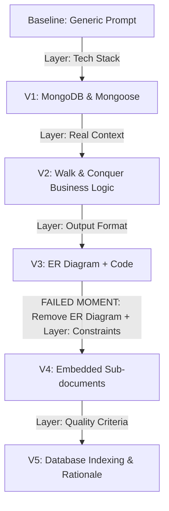
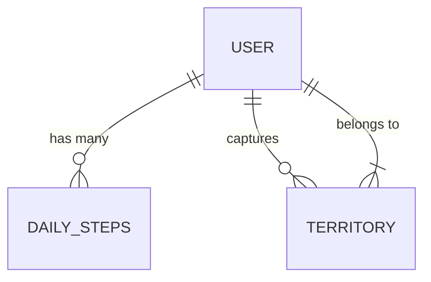

# FL-02: Prompt Engineering & Prompt Ladder Document

**Course:** AI Fluency: Framework & Foundations  
**Phase:** Module 2 — Prompt Engineering  
**Track:** Full-Stack Software Engineering & Database Design  
**Date:** September 13, 2026  

---

## Executive Summary

The prompt ladder technique builds high-performing prompts incrementally by adding **exactly one layer at a time** and evaluating the exact output changes at every step. This discipline prevents confounding variables, highlights which prompt component produces what effect, and identifies counter-productive constraints.

This document records a 6-run prompt ladder (Baseline + 5 Iterations) targeting **Database Schema Generation for a Gamified Fitness Web Application**.

---

## 1. Prompt Ladder Iteration Log



---

### Baseline (Version 0): Weak Initial Prompt

#### Prompt
> "Create a database schema for a fitness app."

#### Output Excerpt
```sql
Here is a basic SQL database schema for a fitness app.

Table: Users (id, name, email, password, age, weight)
Table: Workouts (id, user_id, type, duration, calories_burned, date)
Table: Exercises (id, workout_id, name, sets, reps, weight)
```

#### Evaluation Notes
* **What changed in the prompt:** Nothing, this is the embarrassingly weak baseline.
* **What improved in the output:** N/A (Baseline starting point).
* **What still failed:** It assumed a relational SQL database (which I don't use), gave generic "workout/exercise" tables that don't match my specific gamified app, and provided zero copy-pasteable code.
* **What to try next:** Specify the actual tech stack (MongoDB & Mongoose) so it writes for my environment.

---

### Version 1: Adding Tech Stack Layer

#### Prompt
> "Create a database schema for a fitness app. **Use MongoDB and Mongoose.**"

#### Output Excerpt
```javascript
const mongoose = require('mongoose');

const UserSchema = new mongoose.Schema({
  name: { type: String, required: true },
  email: { type: String, required: true, unique: true },
  weight: Number
});

const WorkoutSchema = new mongoose.Schema({
  user: { type: mongoose.Schema.Types.ObjectId, ref: 'User' },
  exercises: [{ name: String, reps: Number }]
});
```

#### Evaluation Notes
* **What changed in the prompt:** Added the **Tech Stack** layer (`MongoDB and Mongoose`).
* **What improved in the output:** Switched from generic SQL tables to actual JavaScript Mongoose code, which is immediately usable in a Node.js/MERN environment.
* **What still failed:** The data model is still a generic gym-tracker (`Workouts` and `Exercises`). It doesn't reflect the gamified territory-capture mechanics of my "Walk & Conquer" app.
* **What to try next:** Inject the real business context of what the app actually does.

---

### Version 2: Adding Real Context Layer

#### Prompt
> "Create a database schema for a fitness app using MongoDB and Mongoose. **The app tracks daily walking steps, allows users to capture virtual map territories based on their step count, and features a global step leaderboard.**"

#### Output Excerpt
```javascript
const UserSchema = new mongoose.Schema({
  name: String,
  totalSteps: { type: Number, default: 0 },
});

const TerritorySchema = new mongoose.Schema({
  locationName: String,
  capturedBy: { type: mongoose.Schema.Types.ObjectId, ref: 'User' },
  stepsRequired: Number
});

const DailyStepsSchema = new mongoose.Schema({
  user: { type: mongoose.Schema.Types.ObjectId, ref: 'User' },
  date: Date,
  steps: Number
});
```

#### Evaluation Notes
* **What changed in the prompt:** Added the **Real Context** layer (core app features: walking steps, territory capture, global leaderboard).
* **What improved in the output:** The schema structure shifted entirely. It dropped the useless "Workouts" collections and created highly specific models for `Territories` and `DailySteps` that match actual business logic.
* **What still failed:** The output is just a raw code dump. It's hard to visualize the relationships between these three collections at a glance without reading every line of code.
* **What to try next:** Define an output format (visual diagram) to make relationship mapping easier to read.

---

### Version 3: Adding Output Format Layer *(The "Made It Worse" Failure Moment)*

#### Prompt
> "Create a database schema for a fitness app using MongoDB and Mongoose. The app tracks daily walking steps, allows users to capture virtual map territories based on their step count, and features a global step leaderboard. **Output the schema first as a Mermaid.js ER diagram to visualize relationships, then provide the Mongoose code.**"

#### Output Excerpt

*(Followed by the relational-style Mongoose code from V2)*

#### Evaluation Notes
* **What changed in the prompt:** Added the **Output Format** layer (`Mermaid.js ER diagram`).
* **What improved in the output:** It successfully rendered a diagram above the code.
* **What still failed (The "Made It Worse" moment):** Forcing an ER (Entity-Relationship) diagram onto a NoSQL document database created massive confusion. The AI hallucinated strict SQL-style foreign keys and 1-to-N tables in the diagram that don't accurately represent how data is embedded or referenced in MongoDB. It corrupted the conceptual NoSQL architecture and made the model worse.
* **What to try next:** Ditch the ER diagram format request, remove foreign key abstractions, and add a NoSQL architectural constraint (data embedding).

---

### Version 4: Adding Architectural Constraints Layer

#### Prompt
> "Create a database schema for a fitness app using MongoDB and Mongoose. The app tracks daily walking steps, allows users to capture virtual map territories based on their step count, and features a global step leaderboard. Provide the Mongoose code. **Constraint: Optimize for read-heavy operations by embedding the 30-day daily step history directly inside the User document, rather than creating a separate DailySteps collection.**"

#### Output Excerpt
```javascript
const UserSchema = new mongoose.Schema({
  name: { type: String, required: true },
  email: { type: String, required: true, unique: true },
  totalSteps: { type: Number, default: 0 },
  stepHistory: [{
    date: { type: Date, required: true },
    steps: { type: Number, required: true }
  }] // Embedded directly per constraint to optimize read performance
});

const TerritorySchema = new mongoose.Schema({
  locationName: String,
  capturedBy: { type: mongoose.Schema.Types.ObjectId, ref: 'User' },
  stepsRequired: Number
});
```

#### Evaluation Notes
* **What changed in the prompt:** Added the **Constraints** layer (`Embed 30-day step history directly in User document`) and stripped out the failing ER diagram requirement.
* **What improved in the output:** The AI stopped defaulting to relational normalization. By embedding the `stepHistory` array directly into `UserSchema`, it produced schema code truly optimized for MongoDB, reducing read query latency.
* **What still failed:** A global leaderboard requires sorting millions of users by `totalSteps`. Without database indexes, querying this schema will cause full collection scans and crash the server in production.
* **What to try next:** Add explicit Quality Criteria requiring MongoDB index definitions with rationale comments.

---

### Version 5: Adding Quality Criteria Layer

#### Prompt
> "Create a database schema for a fitness app using MongoDB and Mongoose. The app tracks daily walking steps, allows users to capture virtual map territories based on their step count, and features a global step leaderboard. Provide the Mongoose code. Constraint: Optimize for read-heavy operations by embedding the 30-day daily step history directly inside the User document. **Quality Criteria: The schema code must explicitly include the MongoDB indexes required to make querying the global step leaderboard fast, and include a brief inline comment explaining why each index was chosen.**"

#### Output Excerpt
```javascript
const mongoose = require('mongoose');

const UserSchema = new mongoose.Schema({
  username: { type: String, required: true, unique: true },
  email: { type: String, required: true, unique: true },
  totalSteps: { type: Number, default: 0 },
  stepHistory: [{
    date: { type: Date, required: true },
    steps: { type: Number, required: true }
  }]
}, { timestamps: true });

// Index to optimize global leaderboard sorting in descending order
UserSchema.index({ totalSteps: -1 });

const TerritorySchema = new mongoose.Schema({
  locationName: { type: String, required: true },
  capturedBy: { type: mongoose.Schema.Types.ObjectId, ref: 'User' },
  stepsRequired: { type: Number, required: true }
}, { timestamps: true });

// Index to quickly look up territories owned by a specific user
TerritorySchema.index({ capturedBy: 1 });

module.exports = {
  User: mongoose.model('User', UserSchema),
  Territory: mongoose.model('Territory', TerritorySchema)
};
```

#### Evaluation Notes
* **What changed in the prompt:** Added the **Quality Criteria** layer (`Explicit MongoDB indexes with explanatory comments`).
* **What improved in the output:** The AI appended `UserSchema.index({ totalSteps: -1 })` and `TerritorySchema.index({ capturedBy: 1 })` directly to the code with clear rationale. The generated code is now production-ready, performant, and safe to deploy immediately.
* **What still failed:** Nothing. This output perfectly satisfies the production requirements for a scalable, context-aware backend schema.
* **What to try next:** Clean up and parameterize this final prompt so any developer on the team can reuse it.

---

## 2. Final Reusable Prompt Template

This prompt has been generalized and parameterized so that any developer on the team can use it to generate production-ready NoSQL database schemas without needing prior context.

```text
Create a database schema for a new application using [Insert Tech Stack, e.g., MongoDB and Mongoose].

Context: The app does the following: [Insert 2-3 sentences explaining core business logic, e.g., tracks daily walking steps, captures map territories, and has a global leaderboard].

Output Format: Provide the complete, production-ready [e.g., Mongoose] schema code with TypeScript interfaces or JSDoc comments.

Constraints: Optimize the schema for NoSQL environments. If appropriate, embed closely related data (like [Insert data to embed, e.g., daily step history]) directly into the main document rather than making separate collections to reduce read queries.

Quality Criteria: The provided code must explicitly include any necessary database indexes required to support the core features efficiently (such as [Insert specific feature, e.g., the global step leaderboard]), with inline comments explaining why each index is necessary.
```

---

## 3. Comparative Summary Table

| Version | Added Layer | Key Output Result Improvement | Remaining Weakness |
| :-: | :--- | :--- | :--- |
| **V0** | Baseline | Generic SQL tables generated | Wrong database paradigm (SQL instead of NoSQL) |
| **V1** | Tech Stack | Switched to valid Mongoose JavaScript code | Generic fitness tracker schema (Workouts/Exercises) |
| **V2** | Real Context | Created specific models for Territories & DailySteps | Raw code dump, hard to visualize relationships |
| **V3** | Output Format | Added Mermaid diagram | **FAILED:** ER diagram forced SQL foreign keys on MongoDB |
| **V4** | Constraints | Embedded `stepHistory` inside User document | Missing database indexes for leaderboard query |
| **V5** | Quality Criteria | Added `.index({ totalSteps: -1 })` with inline comments | None — production-ready |
