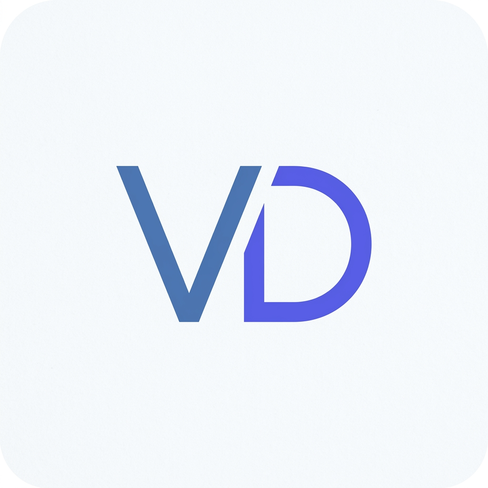
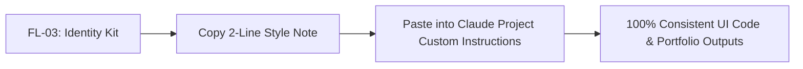

# FL-03: Personal Brand Identity Kit

**Course:** AI Fluency: Framework & Foundations  
**Phase:** Module 3 — Foundations & Identity  
**Track:** General AI Fluency / Full-Stack Engineering  
**Student / Engineer:** Vinay Dhiman  
**Date:** September 13, 2026  

---

## Executive Summary

A consistent visual identity separates a portfolio that feels intentional from one that feels thrown together. By locking in typography, a tight color palette, and a simple monogram once, every web application, case study, and project output automatically inherits a coherent, professional aesthetic.

This **Identity Kit** establishes a clean, modern-tech aesthetic designed to keep engineering work as the loudest element on the page.

---

## 1. Typography Pair (Google Fonts)

Only two core typefaces are selected to maintain extreme visual discipline: **Outfit** for headings and **Inter** for body text (plus **JetBrains Mono** for code blocks).

| Role | Font Name | Type Family | Fallback Stack | Rationale |
| :--- | :--- | :--- | :--- | :--- |
| **Heading Font** | **Outfit** | Geometric Sans-Serif | `'Outfit', -apple-system, sans-serif` | Clean, modern geometric structure that gives titles a crisp, authoritative tech identity. |
| **Body Font** | **Inter** | Neo-Grotesque Sans-Serif | `'Inter', system-ui, sans-serif` | Engineered specifically for digital screens; unmatched legibility at all font sizes. |
| **Code / Monospace** | **JetBrains Mono** | Monospaced | `'JetBrains Mono', monospace` | High-legibility monospaced typeface for code snippets and technical tables. |

### CSS Font Imports

```css
/* Google Fonts Import */
@import url('https://fonts.googleapis.com/css2?family=Inter:wght@400;500;600;700&family=JetBrains+Mono:wght@400;500&family=Outfit:wght@600;700;800&display=swap');

:root {
  --font-heading: 'Outfit', sans-serif;
  --font-body: 'Inter', sans-serif;
  --font-code: 'JetBrains Mono', monospace;
}
```

---

## 2. Color Palette (Tight 4-Color System)

The palette is restricted to 4 harmonious colors. The calm background (`#F8FAFC`) and high-contrast text (`#0F172A`) ensure maximum readability, while the slate-blue and indigo accents draw subtle focus to key actions.

### Palette Matrix

| Color Role | Color Name | Hex Code | RGB | HSL | Usage Guidelines |
| :--- | :--- | :--- | :--- | :--- | :--- |
| **Background (Near-White)** | Slate 50 | `#F8FAFC` | `rgb(248, 250, 252)` | `hsl(210, 40%, 98%)` | Main page background, calm canvas background. |
| **Text & Main (Near-Black)** | Slate 900 | `#0F172A` | `rgb(15, 23, 42)` | `hsl(222, 47%, 11%)` | Primary headings, body copy, high-contrast text. |
| **Main Accent** | Electric Slate Blue | `#3B82F6` | `rgb(59, 130, 246)` | `hsl(217, 91%, 60%)` | Primary buttons, active links, key CTA elements. |
| **Secondary Accent** | Indigo Highlight | `#6366F1` | `rgb(99, 102, 241)` | `hsl(239, 84%, 67%)` | Hover states, badge borders, subtle tag highlights. |
| **Surface Card** | Pure White | `#FFFFFF` | `rgb(255, 255, 255)` | `hsl(0, 0%, 100%)` | Content container cards, code block backgrounds. |

### Color Swatch Breakdown

```text
┌───────────────────────────┬───────────────────────────┐
│  BACKGROUND (Near-White)  │  TEXT & MAIN (Near-Black) │
│         #F8FAFC           │         #0F172A           │
├───────────────────────────┼───────────────────────────┤
│  MAIN ACCENT (Slate Blue) │ SECONDARY ACCENT (Indigo) │
│         #3B82F6           │         #6366F1           │
└───────────────────────────┴───────────────────────────┘
```

---

## 3. Logo & Monogram Asset

The brand identity uses a minimal, geometric monogram combining the initials **VD** (Vinay Dhiman). It functions seamlessly as a portfolio header logo, favicon (32x32), or social avatar.

### Monogram Asset Preview



### Vector SVG Source Code

```xml
<svg width="128" height="128" viewBox="0 0 128 128" fill="none" xmlns="http://www.w3.org/2000/svg">
  <!-- Background Container -->
  <rect width="128" height="128" rx="28" fill="#F8FAFC"/>
  <rect x="2" y="2" width="124" height="124" rx="26" stroke="#0F172A" stroke-opacity="0.1" stroke-width="4"/>
  
  <!-- Geometric Monogram "VD" -->
  <!-- V Shape -->
  <path d="M32 44L48 84L64 44" stroke="#3B82F6" stroke-width="10" stroke-linecap="round" stroke-linejoin="round"/>
  
  <!-- D Shape -->
  <path d="M68 44H84C92.8366 44 100 51.1634 100 60V68C100 76.8366 92.8366 84 84 84H68V44Z" stroke="#6366F1" stroke-width="10" stroke-linecap="round" stroke-linejoin="round"/>
</svg>
```

---

## 4. Two-Line Style Note (For Claude Project System Instructions)

Below is the exact two-line style note to add to your Claude Project Custom Instructions. It ensures all AI-generated web interfaces, case studies, and UI components match this exact identity kit automatically.

> **STYLE & IDENTITY:** Headings: `Outfit` (700/800), Body: `Inter` (400/500), Code: `JetBrains Mono`. Palette: Background `#F8FAFC`, Text/Headings `#0F172A`, Main Accent `#3B82F6`, Secondary Accent `#6366F1`, Cards `#FFFFFF`.  
> **MOOD:** Minimalist, modern-tech, and high-contrast—a calm, clean aesthetic where engineering output and clear typography are the loudest elements on the page.

---

## 5. Claude Project Integration Walkthrough

To apply this Identity Kit across all future AI conversations and UI builds:

1. Open your Claude Project: `AI Fluency & Web Dev Command Center`.
2. Click **Project Settings** $\rightarrow$ **Custom Instructions**.
3. Under **Tone & Interaction Preferences**, append the **Two-Line Style Note** above.
4. Save changes.



---

## 6. Pass / Revise Criteria Checklist

- [x] **One or two fonts, not a pile:** Restrictive selection of Outfit (headings) and Inter (body).
- [x] **Tight palette (3–4 colors) with actual hex codes:** `#F8FAFC`, `#0F172A`, `#3B82F6`, `#6366F1`.
- [x] **Simple logo/favicon exists:** Monogram `VD` generated as PNG asset & SVG vector code.
- [x] **Coherent mood:** Single, calm, tech-minimalist mood statement framing the engineering work.
