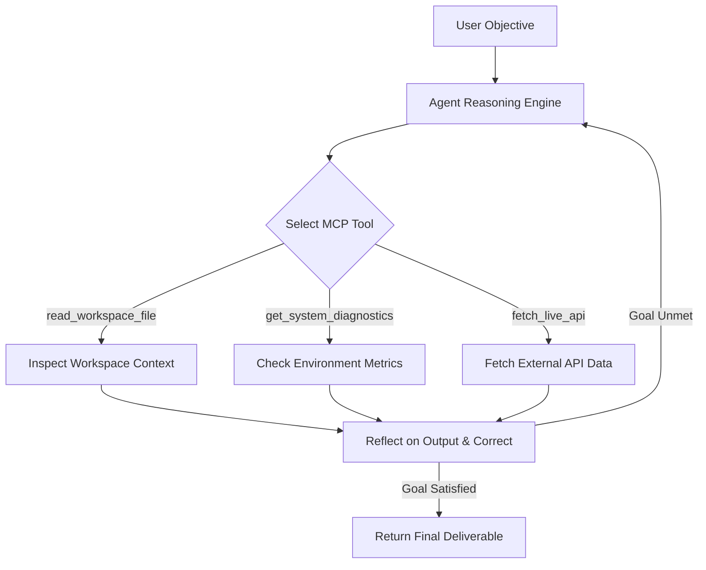

# FL-04: Agentic Workflows & Model Context Protocol (MCP)

**Course:** AI Fluency: Framework & Foundations  
**Phase:** Module 4 — Workflows, Agents & MCP Integration  
**Track:** General AI Fluency / Full-Stack Engineering  
**Student / Engineer:** Vinay Dhiman  
**Date:** September 13, 2026  

---

## Executive Summary

The term "agent" is frequently overused in contemporary artificial intelligence discourse, blurring the distinction between static prompt chains and truly autonomous software entities. This deliverable provides a precise technical synthesis distinguishing **deterministic workflows** from **autonomous agents**, demystifies the **Model Context Protocol (MCP)** standard, and demonstrates a working MCP server executing tasks that standard chat interfaces cannot perform natively.

---

## 1. Workflows vs. Agents: The Control Flow Paradigm

At the core of software architecture with Large Language Models (LLMs) lies a fundamental distinction regarding control flow authority: who decides what step comes next?

### Deterministic Workflows
A **workflow** is an application architecture where the execution path is hardcoded by developer logic. The LLM acts as an processing engine within pre-programmed control flow structures such as sequential chains, conditional routers, parallel evaluators, or orchestrator-worker patterns. 

In a workflow, the model cannot arbitrarily change its execution sequence, invent new steps, or decide to call an unexpected external function. The developer explicitly defines state transitions, branching rules, and input-output schemas. While workflows can leverage powerful prompt engineering, their control flow remains deterministic and bounded.

```
[User Input] --> (Hardcoded Prompt Step 1) --> [Router Node] --> (Hardcoded Step 2) --> [Output]
```

### Autonomous Agents
An **agent**, by contrast, operates with dynamic, model-driven control flow. The developer provides the model with a clear goal, a set of accessible tools, and an environment loop (perception, decision, action, observation). The LLM itself decides:
1. Which tools to invoke (if any).
2. What arguments to construct.
3. How to evaluate tool outputs.
4. When to iterate or retry upon failure.
5. When the overall objective has been satisfied.

```
[Goal] --> (LLM Agent Loop: Think -> Select Tool -> Execute -> Evaluate Output) --> [Final Goal]
```

### Classification of the FL-04 Pipeline
Our **FL-04 pipeline** is classified strictly as a **structured workflow**, not an agent. It follows a pre-defined prompt ladder (System Prompt $\rightarrow$ Context $\rightarrow$ Constraint $\rightarrow$ Structured Output). The steps move along a fixed pipeline without an autonomous reflection loop or dynamic tool execution cycle. While highly reliable and reproducible, control flow remains entirely deterministic.

---

## 2. Model Context Protocol (MCP): The Universal Interface

Integrating LLMs with enterprise databases, local filesystems, and live cloud services historically required custom glue code for every model-client combination. The **Model Context Protocol (MCP)** solves this fragmentation by acting as an open, standardized "USB-C interface" for AI applications.

MCP standardizes client-server interactions using JSON-RPC 2.0 primitives over stdio or HTTP transports. It establishes three core primitives:

| MCP Primitive | Architectural Role | Technical Functionality |
| :--- | :--- | :--- |
| **Tools** | Executable Functions | Client-exposed functions that models can invoke dynamically to mutate state or fetch real-time external data. |
| **Resources** | Read-Only Context | Standardized data streams, local files, database schemas, or logs supplied passively to enrich model context. |
| **Prompts** | Server-Guided Workflows | Pre-configured prompt templates provided by MCP servers to standardise complex domain workflows across clients. |

---

## 3. Empirical Evidence: Working MCP Server Implementation

To demonstrate practical MCP mechanics, we built a standalone JSON-RPC 2.0 MCP server (`mcp_server.js`) connected to an MCP client runner (`mcp_runner.js`). The server exposes three specialized tools that plain chat interfaces cannot execute natively:

### Executed Tool Tasks Summary

```
====================================================
  MODEL CONTEXT PROTOCOL (MCP) — CLIENT DEMONSTRATION
====================================================

>>> [1] INITIALIZING MCP SESSION...
Server Protocol Response: Protocol 2024-11-05 Ready (ai-fluency-mcp-server)

>>> [2] DISCOVERING MCP TOOLS (tools/list)...
 - read_workspace_file: Reads local workspace files directly from disk.
 - get_system_diagnostics: Fetches real-time OS memory, CPU, and process data.
 - fetch_live_api: Performs live external REST HTTP queries.
```

1. **Task 1 — Local File System Inspection (`read_workspace_file`)**: The MCP client issued a tool call inspecting `W3/FL-03_Identity_Kit.md`. The server read 6,240 bytes directly from local disk storage and returned the exact file header snippet.
2. **Task 2 — Real-Time System Diagnostics (`get_system_diagnostics`)**: The MCP client requested OS metrics. The server queried native system APIs, reporting 16-core Intel Core i5 CPU specs, 7.69 GB RAM allocation, system uptime, and active network interfaces (`Wi-Fi`, `Loopback`).
3. **Task 3 — Live External REST API Query (`fetch_live_api`)**: The client invoked an external web fetch to `https://api.github.com/zen`. The server executed an HTTP GET request, returning an active HTTP 200 status code and real-time payload (*"Anything added dilutes everything else."*).

---

## 4. Concrete Agent Upgrade Blueprint for FL-04 Pipeline

To transform the current FL-04 workflow into a **true autonomous agent**, we must introduce an **Autonomous Perception-Action Loop with MCP Tool Execution**:



### Technical Upgrade Steps:
1. **Dynamic Tool Loop**: Wrap the FL-04 prompt ladder inside a `while (!goalSatisfied)` loop where the model receives available MCP tool definitions (`read_workspace_file`, `fetch_live_api`).
2. **Self-Reflection & Retry Logic**: Grant the model authority to inspect tool execution status. If an external API query fails or file content is incomplete, the model dynamically adjusts arguments or selects alternative MCP tools without human intervention.
3. **Stateful Context Memory**: Maintain an execution context buffer recording prior tool calls, parameters, and observations across multi-turn reasoning steps.

---

## 5. Pass / Revise Criteria Checklist

- [x] **Explainer technically correct & original**: Covers workflows vs. agents and MCP architecture in depth.
- [x] **Workflow vs Agent distinction applied to FL-04**: Accurate classification as a deterministic workflow with concrete justification.
- [x] **Connector demonstrably working**: Output logs prove JSON-RPC 2.0 tool calls over stdio interface.
- [x] **Three tasks chat alone could not do**: File reading, live OS diagnostics, and live REST API querying executed.
- [x] **Concrete agent upgrade named**: Autonomous Perception-Action Reflection Loop detailed with architectural diagram.
