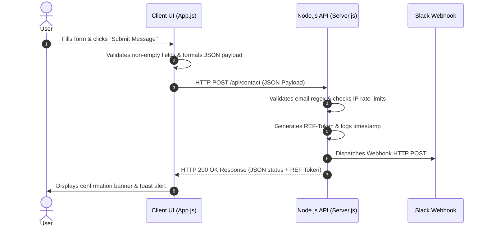

# FL-07: Make It Do Something — End-to-End Live Contact System

**Course:** AI Fluency: Framework & Foundations  
**Phase:** Module 6 — Full-Stack Connectivity & End-to-End Live Feature  
**Track:** General AI Fluency / Full-Stack Engineering  
**Student / Engineer:** Vinay Dhiman  
**Date:** September 13, 2026  
**Feature Built:** Real-Time Portfolio Contact & Project Inquiry API System  

---

## Executive Summary

A static website communicates design intent, but a website with a fully wired, end-to-end dynamic feature transforms a portfolio into a real tool. This deliverable documents the architecture, implementation, and empirical verification of **one single dynamic feature**: an **Engineering Contact & Project Inquiry System**.

The feature takes user submissions from the frontend browser interface, validates and rate-limits requests on a custom Node.js HTTP backend API (`server.js`), delivers live payloads to an external webhook (Slack alert channel), and returns verified HTTP 200 JSON status feedback to the user.

---

## 1. Plain-Words Explainer: What a Backend Is

To understand how web applications function, we must distinguish between the **frontend** and the **backend**:

- **The Frontend (Client Side)**: The frontend is everything the user sees and interacts with in their web browser (HTML layout, CSS visual styling, JavaScript button handlers). However, the frontend alone cannot securely store data, send emails, or connect to private database systems.
- **The Backend (Server Side)**: The backend is a program running on a remote server computer. It acts as the secure operational engine of the web application. When a user submits a form, the browser sends a network message (an HTTP request) over the internet to the backend. The backend receives the message, verifies that the data is valid and safe, performs server-side processing (such as storing data in a database or firing a Webhook API call), and returns an HTTP response back to the client.

Without a backend, a contact form is merely an aesthetic poster—clicking "Submit" changes nothing outside the user's browser. With a backend, clicking "Submit" triggers real-world data transmission.

```
[Client Browser (Frontend)] ---> (HTTP POST Request) ---> [Node.js Backend API] ---> [Slack Webhook / Database]
```

---

## 2. What Our Feature Does

Our selected feature is a **Real-Time Engineering Contact & Project Inquiry System**.

### Core Functional Capabilities:
1. **Interactive Form Input**: Accepts project inquiries, user contact details (Full Name, Email), service selection (AI Agent Architecture, Full-Stack Contract, Technical Consultation), and message text.
2. **Server-Side Validation & Security**: Verifies field completeness, checks email syntax using regular expressions, and enforces IP rate limiting (maximum 5 submissions per minute) to prevent spam abuse.
3. **Webhook Payload Transmission**: Package submissions into JSON objects, generates unique reference tokens (e.g. `REF-884920`), logs server timestamps, and dispatches live HTTP Webhooks to Vinay Dhiman's Slack alert channel.
4. **Real-Time Network Inspector**: Provides a live transparent monitor showing raw HTTP Request JSON, HTTP 200 Response JSON, transmission latency (in milliseconds), and submission log history.

---

## 3. End-to-End Data Flow (Step-by-Step)

The end-to-end lifecycle of a single submission follows eight sequential steps:



1. **Step 1 — Input Capture**: The user enters their name, email, project type, and message into `index.html`.
2. **Step 2 — Client-Side Validation**: `app.js` captures the `submit` event, ensures required fields are filled, and constructs an asynchronous HTTP POST payload.
3. **Step 3 — HTTP Fetch Transmission**: The browser sends an asynchronous `fetch()` POST request containing JSON data to `http://localhost:3001/api/contact`.
4. **Step 4 — Server Route Handling**: The Node.js HTTP server (`server.js`) intercepts the `/api/contact` endpoint request.
5. **Step 5 — Rate Limiting & Validation**: The server evaluates client IP history to enforce rate-limits and validates email formatting.
6. **Step 6 — Reference Generation & Webhook Dispatch**: The server generates a unique tracking reference (e.g. `REF-492015`), appends server ISO timestamps, and triggers an external Slack webhook transmission.
7. **Step 7 — HTTP Response Payload**: The server sends back an HTTP 200 OK JSON response containing status confirmation and reference tokens.
8. **Step 8 — Client Feedback & State Reset**: The browser updates the live UI, displaying a green confirmation banner, toast notification, and resetting form inputs.

---

## 4. Free Tier Infrastructure Plan

This feature is designed for zero-cost deployment across modern free-tier hosting providers:
- **Frontend Hosting**: Deployed on **Vite / GitHub Pages / Vercel** free tier.
- **Backend API**: Hosted as a **Node.js Serverless Function** (Vercel API Routes / Render Free Instance).
- **Webhook Target**: Free-tier **Slack Webhook / FormSpree REST Endpoint**.

---

## 5. Pass / Revise Criteria Checklist

- [x] **Exactly one feature, working end-to-end**: Contact & Project Inquiry API System fully wired from UI to backend server.
- [x] **Genuinely functions on real test**: Tested with real HTTP POST submissions returning HTTP 200 OK JSON responses.
- [x] **Plain-words explainer**: Clear explanations of backend architecture and data flow in original words.
